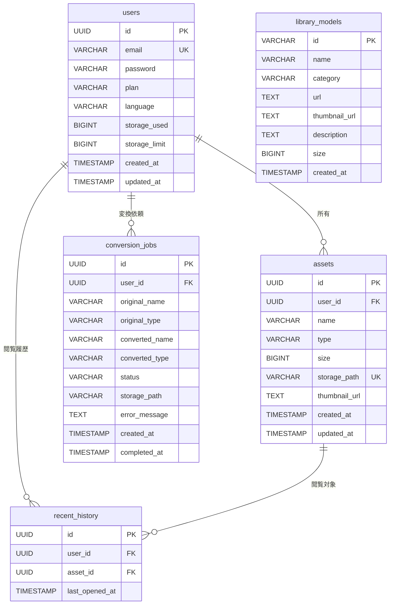

# DB 設計

## Prisma スキーマ定義

```prisma
// prisma/schema.prisma

generator client {
  provider = "prisma-client-js"
}

datasource db {
  provider = "postgresql"
  url      = env("DATABASE_URL")
}

// ユーザーテーブル
model User {
  id            String   @id @default(uuid()) @db.Uuid
  email         String   @unique @db.VarChar(255)
  password      String   @db.VarChar(255)
  plan          String   @db.VarChar(20)  // free, pro, enterprise
  language      String   @default("ja") @db.VarChar(5)  // ja, en
  storageUsed   BigInt   @default(0) @map("storage_used")
  storageLimit  BigInt   @map("storage_limit")  // プランにより異なる
  createdAt     DateTime @default(now()) @map("created_at")
  updatedAt     DateTime @updatedAt @map("updated_at")

  assets         Asset[]
  recentHistory  RecentHistory[]
  conversionJobs ConversionJob[]

  @@index([email], name: "idx_users_email")
  @@map("users")
}

// 3Dアセットテーブル
model Asset {
  id           String   @id @default(uuid()) @db.Uuid
  userId       String   @map("user_id") @db.Uuid
  name         String   @db.VarChar(255)
  type         String   @db.VarChar(10)  // obj, glb, gltf
  size         BigInt
  storagePath  String   @unique @map("storage_path") @db.VarChar(512)
  thumbnailUrl String?  @map("thumbnail_url") @db.Text
  createdAt    DateTime @default(now()) @map("created_at")
  updatedAt    DateTime @updatedAt @map("updated_at")

  user          User            @relation(fields: [userId], references: [id], onDelete: Cascade)
  recentHistory RecentHistory[]

  @@index([userId], name: "idx_assets_user_id")
  @@index([type], name: "idx_assets_type")
  @@index([createdAt(sort: Desc)], name: "idx_assets_created_at")
  @@map("assets")
}

// 閲覧履歴テーブル（最大20件/ユーザー）
model RecentHistory {
  id           String   @id @default(uuid()) @db.Uuid
  userId       String   @map("user_id") @db.Uuid
  assetId      String   @map("asset_id") @db.Uuid
  lastOpenedAt DateTime @map("last_opened_at")

  user  User  @relation(fields: [userId], references: [id], onDelete: Cascade)
  asset Asset @relation(fields: [assetId], references: [id], onDelete: Cascade)

  @@unique([userId, assetId], name: "idx_recent_history_user_asset")
  @@index([userId], name: "idx_recent_history_user_id")
  @@index([lastOpenedAt(sort: Desc)], name: "idx_recent_history_last_opened")
  @@map("recent_history")
}

// パブリックライブラリテーブル
model LibraryModel {
  id           String   @id @db.VarChar(50)
  name         String   @db.VarChar(255)
  category     String   @db.VarChar(10)  // obj, glb, gltf
  url          String   @db.Text
  thumbnailUrl String?  @map("thumbnail_url") @db.Text
  description  String?  @db.Text
  size         BigInt
  createdAt    DateTime @default(now()) @map("created_at")

  @@index([category], name: "idx_library_category")
  @@index([createdAt(sort: Desc)], name: "idx_library_created_at")
  @@map("library_models")
}

// 変換ジョブテーブル（30日間保持）
model ConversionJob {
  id             String    @id @default(uuid()) @db.Uuid
  userId         String    @map("user_id") @db.Uuid
  originalName   String    @map("original_name") @db.VarChar(255)
  originalType   String    @map("original_type") @db.VarChar(10)
  convertedName  String    @map("converted_name") @db.VarChar(255)
  convertedType  String    @map("converted_type") @db.VarChar(10)
  status         String    @db.VarChar(20)  // pending, processing, completed, failed
  storagePath    String?   @map("storage_path") @db.VarChar(512)
  errorMessage   String?   @map("error_message") @db.Text
  createdAt      DateTime  @default(now()) @map("created_at")
  completedAt    DateTime? @map("completed_at")

  user User @relation(fields: [userId], references: [id], onDelete: Cascade)

  @@index([userId], name: "idx_conversion_user_id")
  @@index([status], name: "idx_conversion_status")
  @@index([createdAt(sort: Desc)], name: "idx_conversion_created_at")
  @@map("conversion_jobs")
}
```

## ER 図



## セットアップ

```bash
# マイグレーション作成
npx prisma migrate dev --name init

# 本番環境デプロイ
npx prisma migrate deploy

# Prismaクライアント生成
npx prisma generate
```

## シーディング

```typescript
// prisma/seed.ts
import { PrismaClient } from "@prisma/client";

const prisma = new PrismaClient();

async function main() {
  await prisma.libraryModel.createMany({
    data: [
      {
        id: "model-001",
        name: "FlexiSpot Cherry Blossom",
        category: "glb",
        url: "/glb/FlexiSpot_cherryblossom.glb",
        thumbnailUrl: "/glb/FlexiSpot_cherryblossom.png",
        description: "FlexiSpot デスク チェリー",
        size: 1024000,
      },
    ],
  });
}

main()
  .catch((e) => {
    console.error(e);
    process.exit(1);
  })
  .finally(async () => {
    await prisma.$disconnect();
  });
```
