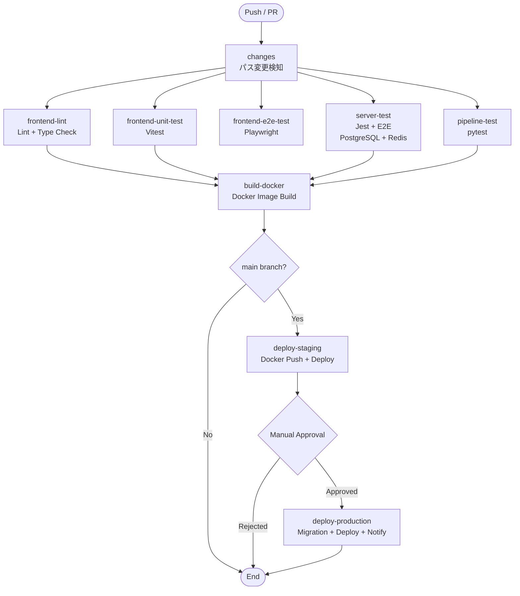

# Phase 2: バックエンド設計書

## プロジェクト概要

Studio View のバックエンド実装。Phase 2 では NestJS + Prisma サーバーと、FastAPI 変換パイプラインをローカル環境で構築する。3D 変換処理は非同期ジョブキューで処理し、ファイルストレージには MinIO を使用する。

## 技術スタック

### Server (NestJS + Prisma)

| 技術                | バージョン | 用途                         |
| ------------------- | ---------- | ---------------------------- |
| **Node.js**         | 20.x       | ランタイム                   |
| **TypeScript**      | 5.x        | 型安全な開発                 |
| **NestJS**          | 10.x       | Web フレームワーク           |
| **Prisma**          | 5.x        | ORM（PostgreSQL）            |
| **PostgreSQL**      | 16.x       | データベース                 |
| **Redis**           | 7.x        | ジョブキュー・キャッシュ     |
| **BullMQ**          | 5.x        | 非同期ジョブ処理             |
| **MinIO**           | latest     | オブジェクトストレージ       |
| **JWT**             | 10.x       | 認証トークン                 |
| **bcrypt**          | 5.x        | パスワードハッシュ化         |
| **class-validator** | 0.14.x     | バリデーション               |
| **@nestjs/swagger** | 7.x        | OpenAPI ドキュメント自動生成 |
| **Jest**            | 29.x       | テストフレームワーク         |

### Pipeline (FastAPI)

| 技術         | バージョン | 用途                 |
| ------------ | ---------- | -------------------- |
| **Python**   | 3.12       | ランタイム           |
| **FastAPI**  | 0.115.x    | Web フレームワーク   |
| **Pydantic** | 2.x        | バリデーション       |
| **obj2gltf** | latest     | OBJ→GLTF 変換ツール  |
| **pytest**   | 8.x        | テストフレームワーク |
| **uvicorn**  | 0.32.x     | ASGI サーバー        |

### インフラ

| 技術           | 用途                     |
| -------------- | ------------------------ |
| **Docker**     | コンテナ化               |
| **PostgreSQL** | データベース             |
| **Redis**      | ジョブキュー・キャッシュ |
| **MinIO**      | オブジェクトストレージ   |

---

## アーキテクチャ

### システム構成

```plaintext
┌──────────────┐
│   Frontend   │ (Phase 1)
│   Next.js    │
└──────┬───────┘
       │ HTTP
       ▼
┌──────────────┐      ┌──────────────┐      ┌──────────────┐
│    Server    │─────▶│    Redis     │◀─────│   Pipeline   │
│   NestJS     │ Enq. │   BullMQ     │ Poll │   FastAPI    │
└──────┬───────┘      └──────────────┘      └──────────────┘
       │                                              │
       │                                              │
       ▼                                              ▼
┌──────────────┐                              ┌──────────────┐
│  PostgreSQL  │                              │    MinIO     │
└──────────────┘                              └──────────────┘
```

**処理フロー**:

1. Frontend → Server: アセットアップロード・変換リクエスト
2. Server → MinIO: ファイル保存
3. Server → Redis: 変換ジョブをキューに追加
4. Pipeline: Redis からジョブを取得し、変換処理
5. Pipeline → MinIO: 変換済みファイルを保存
6. Pipeline → Redis: ジョブ完了をマーク
7. Server: ジョブ完了をポーリング・通知

### レイヤー構造（NestJS モジュール + DDD）

```plaintext
┌─────────────────────────────────────┐
│       Presentation Layer            │  ← Controllers, Guards, Interceptors
├─────────────────────────────────────┤
│       Application Layer             │  ← Services (Use Cases), DTOs
├─────────────────────────────────────┤
│         Domain Layer                │  ← Entities, Repositories (Interface)
├─────────────────────────────────────┤
│      Infrastructure Layer           │  ← Prisma, MinIO, BullMQ, Redis
└─────────────────────────────────────┘
```

**NestJS の主要概念**:

- **Modules**: 機能単位でコードを整理（AuthModule, AssetsModule など）
- **Controllers**: HTTP リクエストを処理（Presentation Layer）
- **Providers**: ビジネスロジックを実装（Services, Repositories）
- **Guards**: 認証・認可チェック（JWT Guard）
- **Interceptors**: リクエスト/レスポンスの変換
- **Pipes**: バリデーション（class-validator）

---

## ディレクトリ構造

### Server

```plaintext
server/
├── prisma/
│   ├── schema.prisma                 # Prismaスキーマ（docs/DB設計.mdから）
│   ├── migrations/                   # マイグレーション
│   └── seed.ts                       # シーディング
├── src/
│   ├── modules/                      # 機能モジュール（NestJS）
│   │   ├── auth/
│   │   │   ├── auth.module.ts
│   │   │   ├── auth.controller.ts
│   │   │   ├── auth.service.ts
│   │   │   ├── dto/
│   │   │   │   ├── login.dto.ts
│   │   │   │   └── refresh-token.dto.ts
│   │   │   ├── guards/
│   │   │   │   └── jwt-auth.guard.ts
│   │   │   └── strategies/
│   │   │       └── jwt.strategy.ts
│   │   ├── assets/
│   │   │   ├── assets.module.ts
│   │   │   ├── assets.controller.ts
│   │   │   ├── assets.service.ts
│   │   │   ├── dto/
│   │   │   │   ├── create-asset.dto.ts
│   │   │   │   ├── get-assets.dto.ts
│   │   │   │   └── asset-response.dto.ts
│   │   │   └── entities/
│   │   │       └── asset.entity.ts
│   │   ├── conversion/
│   │   │   ├── conversion.module.ts
│   │   │   ├── conversion.controller.ts
│   │   │   ├── conversion.service.ts
│   │   │   ├── dto/
│   │   │   │   ├── convert-obj2glb.dto.ts
│   │   │   │   └── job-status.dto.ts
│   │   │   ├── processors/
│   │   │   │   └── conversion.processor.ts  # BullMQワーカー
│   │   │   └── entities/
│   │   │       └── conversion-job.entity.ts
│   │   ├── settings/
│   │   │   ├── settings.module.ts
│   │   │   ├── settings.controller.ts
│   │   │   ├── settings.service.ts
│   │   │   └── dto/
│   │   │       └── update-settings.dto.ts
│   │   └── history/
│   │       ├── history.module.ts
│   │       ├── history.controller.ts
│   │       ├── history.service.ts
│   │       └── dto/
│   │           └── recent-assets.dto.ts
│   ├── infrastructure/               # インフラ層
│   │   ├── database/
│   │   │   ├── prisma.module.ts      # PrismaモジュールNestJS用
│   │   │   ├── prisma.service.ts     # Prismaクライアント
│   │   │   └── repositories/
│   │   │       ├── user.repository.ts
│   │   │       ├── asset.repository.ts
│   │   │       └── conversion-job.repository.ts
│   │   ├── storage/
│   │   │   ├── storage.module.ts
│   │   │   └── minio.service.ts      # MinIOクライアント
│   │   ├── queue/
│   │   │   ├── queue.module.ts
│   │   │   └── bullmq.service.ts     # BullMQクライアント
│   │   └── cache/
│   │       ├── cache.module.ts
│   │       └── redis.service.ts      # Redisクライアント
│   ├── common/                       # 共通コード
│   │   ├── decorators/
│   │   │   └── current-user.decorator.ts
│   │   ├── filters/
│   │   │   └── http-exception.filter.ts
│   │   ├── interceptors/
│   │   │   ├── logging.interceptor.ts
│   │   │   └── transform.interceptor.ts
│   │   ├── guards/
│   │   │   └── throttler.guard.ts    # レート制限
│   │   ├── pipes/
│   │   │   └── validation.pipe.ts
│   │   └── constants/
│   │       └── queue-names.ts
│   ├── config/
│   │   ├── configuration.ts          # 環境変数設定
│   │   ├── database.config.ts
│   │   ├── jwt.config.ts
│   │   ├── minio.config.ts
│   │   └── redis.config.ts
│   ├── app.module.ts                 # ルートモジュール
│   └── main.ts                       # エントリーポイント
├── test/
│   ├── unit/                         # ユニットテスト
│   ├── integration/                  # 統合テスト（e2e）
│   └── jest-e2e.json
├── .env                              # 環境変数
├── package.json
├── tsconfig.json
├── nest-cli.json
└── Dockerfile
```

### Pipeline

```plaintext
pipeline/
├── src/
│   ├── domain/
│   │   ├── models/
│   │   │   ├── conversion_request.py
│   │   │   └── conversion_result.py
│   │   └── services/
│   │       └── conversion_service.py
│   ├── application/
│   │   ├── usecases/
│   │   │   ├── obj_to_glb_usecase.py
│   │   │   └── obj_to_gltf_usecase.py
│   │   └── dto/
│   │       └── conversion_dto.py
│   ├── infrastructure/
│   │   ├── converters/
│   │   │   ├── obj2gltf_converter.py    # obj2gltfツールのラッパー
│   │   │   └── gltf2glb_converter.py    # GLTF→GLB変換
│   │   └── validators/
│   │       └── model_validator.py        # ファイル検証
│   ├── presentation/
│   │   ├── routers/
│   │   │   ├── conversion.py
│   │   │   └── health.py
│   │   └── schemas/
│   │       ├── request.py
│   │       └── response.py
│   ├── config/
│   │   └── settings.py
│   └── main.py
├── tests/
│   ├── unit/
│   └── integration/
├── temp/                               # 一時ファイル保存先
├── requirements.txt
├── pytest.ini
└── Dockerfile
```

## Docker 構成

### compose.yaml

```yaml
version: "3.9"

services:
  db:
    image: postgres:16-alpine
    ports:
      - "5432:5432"
    environment:
      - POSTGRES_USER=user
      - POSTGRES_PASSWORD=password
      - POSTGRES_DB=studio_view
    volumes:
      - db_data:/var/lib/postgresql/data
    healthcheck:
      test: ["CMD-SHELL", "pg_isready -U user"]
      interval: 10s
      timeout: 5s
      retries: 5

  redis:
    image: redis:7-alpine
    ports:
      - "6379:6379"
    volumes:
      - redis_data:/data
    healthcheck:
      test: ["CMD", "redis-cli", "ping"]
      interval: 10s
      timeout: 5s
      retries: 5

  minio:
    image: minio/minio:latest
    ports:
      - "9000:9000"
      - "9001:9001"
    environment:
      - MINIO_ROOT_USER=minioadmin
      - MINIO_ROOT_PASSWORD=minioadmin
    volumes:
      - minio_data:/data
    command: server /data --console-address ":9001"
    healthcheck:
      test: ["CMD", "curl", "-f", "http://localhost:9000/minio/health/live"]
      interval: 10s
      timeout: 5s
      retries: 5

  server:
    build:
      context: ./server
      dockerfile: Dockerfile
    ports:
      - "4000:4000"
    environment:
      - DATABASE_URL=postgresql://user:password@db:5432/studio_view
      - REDIS_HOST=redis
      - REDIS_PORT=6379
      - MINIO_ENDPOINT=minio
      - MINIO_PORT=9000
      - MINIO_ACCESS_KEY=minioadmin
      - MINIO_SECRET_KEY=minioadmin
      - MINIO_BUCKET_NAME=studio-view-assets
      - PIPELINE_API_URL=http://pipeline:8000
      - JWT_SECRET=your-super-secret-jwt-key
      - PORT=4000
    depends_on:
      db:
        condition: service_healthy
      redis:
        condition: service_healthy
      minio:
        condition: service_healthy

  pipeline:
    build:
      context: ./pipeline
      dockerfile: Dockerfile
    ports:
      - "8000:8000"
    environment:
      - REDIS_HOST=redis
      - REDIS_PORT=6379
      - MINIO_ENDPOINT=minio
      - MINIO_PORT=9000
      - MINIO_ACCESS_KEY=minioadmin
      - MINIO_SECRET_KEY=minioadmin
      - MINIO_BUCKET_NAME=studio-view-assets
      - API_PORT=8000
    depends_on:
      redis:
        condition: service_healthy
      minio:
        condition: service_healthy

volumes:
  db_data:
  redis_data:
  minio_data:
```

## CI/CD パイプライン

GitHub Actions による自動化されたテスト・ビルド・デプロイパイプライン。

### ワークフロー構成 (`.github/workflows/ci.yml`)



### 追加ジョブ詳細

#### パス変更検知 (`changes`)

```yaml
filters: |
  frontend: ['frontend/**']
  server: ['server/**']
  pipeline: ['pipeline/**']
  docker: ['**/Dockerfile', 'compose.yaml']
```

#### Server テスト (`server-test`)

- Node.js 20.x + pnpm
- Prisma Client 生成
- Jest (ユニット + E2E)
- サービスコンテナ: PostgreSQL, Redis

#### Pipeline テスト (`pipeline-test`)

- Python 3.12
- pytest + obj2gltf

#### Docker ビルド (`build-docker`)

- Frontend, Server, Pipeline イメージビルド
- needs: すべてのテストジョブ

#### デプロイ (`deploy-staging`, `deploy-production`)

- Staging: 自動デプロイ (main ブランチ)
- Production: 手動承認後にデプロイ + DB マイグレーション

---

### GitHub シークレット管理

| シークレット名     | 説明                       | 用途                     |
| ------------------ | -------------------------- | ------------------------ |
| `DATABASE_URL`     | 本番データベース接続文字列 | PostgreSQL 接続          |
| `JWT_SECRET`       | JWT 署名用シークレットキー | 認証トークン生成・検証   |
| `MINIO_ACCESS_KEY` | MinIO アクセスキー         | オブジェクトストレージ   |
| `MINIO_SECRET_KEY` | MinIO シークレットキー     | オブジェクトストレージ   |
| `REDIS_URL`        | Redis 接続 URL             | ジョブキュー・キャッシュ |
| `DOCKER_USERNAME`  | Docker Hub ユーザー名      | コンテナレジストリ       |
| `DOCKER_PASSWORD`  | Docker Hub パスワード      | コンテナレジストリ       |

---

## 開発の流れ

### Stage 1: 環境構築と基盤実装

**作業内容**:

- Docker Compose で PostgreSQL, Redis, MinIO 起動
- MinIO バケット作成 (`studio-view-assets`)
- NestJS プロジェクト作成 (`nest new server`)
- Prisma セットアップとマイグレーション
- インフラモジュール実装 (PrismaService, MinioService, BullMQService, RedisService)
- 共通機能実装 (エラーハンドリング, ロギング, バリデーション, レート制限)

**完了条件**:

- インフラサービスが正常起動
- MinIO へのファイル操作が動作
- DB マイグレーション完了

---

### Stage 2: 認証とアセット管理

**作業内容**:

- AuthModule 実装 (JWT 認証, bcrypt, JwtAuthGuard)
- Swagger 設定 (`@nestjs/swagger`)
- AssetsModule 実装 (CRUD, Multer アップロード)
- ファイルバリデーション (形式・サイズチェック)
- MinIO へのファイル保存とメタデータ管理

**完了条件**:

- JWT 認証が動作
- Swagger UI で API 仕様確認可能
- アセットアップロード・一覧・削除が動作

---

### Stage 3: 変換パイプラインと非同期処理

**作業内容**:

- FastAPI プロジェクトセットアップ
- 変換エンドポイント実装 (`/conversion/obj2glb`, `/conversion/obj2gltf`)
- ConversionModule 実装 (BullMQ Worker)
- ジョブフロー実装 (Server → Redis → Pipeline → MinIO)
- その他機能実装 (HistoryModule, SettingsModule, LibraryModule)

**完了条件**:

- 非同期変換処理が動作
- ジョブステータス確認可能
- 閲覧履歴・設定・ライブラリ機能が動作

---

### Stage 4: テストとセキュリティ

**作業内容**:

- Server テスト (Jest: ユニット + E2E)
- Pipeline テスト (pytest)
- リフレッシュトークン実装
- CORS 設定最適化
- 入力値バリデーション徹底
- エンドポイント別レート制限設定

**完了条件**:

- 全テストパス、カバレッジ目標達成
- セキュリティ監査通過
- CI/CD でテスト自動実行

---

## 動作確認

実行中サービスの確認コマンド

```bash
docker compose ps
```

エンドポイント一覧

| サービス                | URL                                                | 説明                                                    |
| ----------------------- | -------------------------------------------------- | ------------------------------------------------------- |
| **Server API 情報**     | <http://localhost:4000>                            | エンドポイント一覧表示                                  |
| **Server Swagger UI**   | <http://localhost:4000/api>                        | API ドキュメント（OpenAPI）                             |
| **Server Health**       | <http://localhost:4000/health>                     | ヘルスチェック                                          |
| **Pipeline API 情報**   | <http://localhost:8000>                            | エンドポイント一覧表示                                  |
| **Pipeline Swagger UI** | <http://localhost:8000/docs>                       | API ドキュメント（OpenAPI）                             |
| **Pipeline Health**     | <http://localhost:8000/health/>                    | ヘルスチェック                                          |
| **Prisma Studio**       | <http://localhost:5555>                            | DB 管理画面（`cd server && pnpm prisma:studio` で起動） |
| **MinIO Console**       | <http://localhost:9001/browser/studio-view-assets> | Username: `minioadmin` <br> Password: `minioadmin`      |
| **PostgreSQL**          | localhost:5432                                     | データベース接続（CLI）                                 |
| **Redis**               | localhost:6379                                     | キャッシュ・ジョブキュー接続（CLI）                     |

### 認証フロー確認

**ユーザー登録:**

```bash
curl -X POST http://localhost:4000/auth/register \
  -H "Content-Type: application/json" \
  -d '{"email":"test@example.com","password":"test1234"}'
```

**レスポンス例:**

```json
{
  "access_token": "eyJhbGciOiJIUzI1NiIsInR5cCI6IkpXVCJ9..."
}
```

**ログイン:**

```bash
curl -X POST http://localhost:4000/auth/login \
  -H "Content-Type: application/json" \
  -d '{"email":"test@example.com","password":"test1234"}'
```

**認証確認:**

```bash
TOKEN="<取得したトークン>"
curl -X GET http://localhost:4000/auth/me \
  -H "Authorization: Bearer $TOKEN"
```
