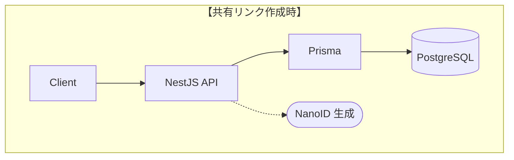
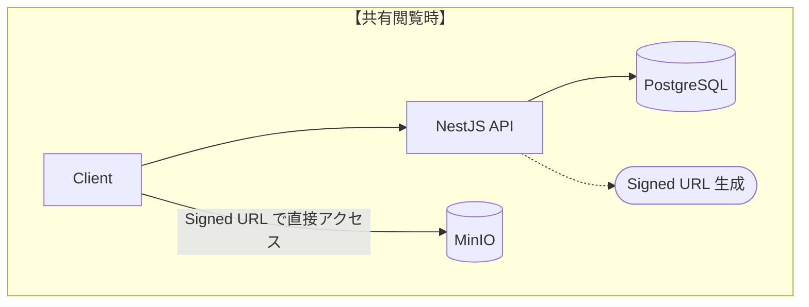
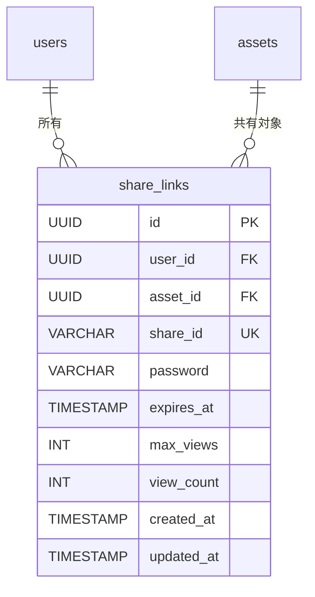

# Phase 3: 要件確定設計書

## プロジェクト概要

Studio View の機能要件確定フェーズ。Phase 3 ではローカル環境で各機能を完成させ、本番デプロイ前の機能検証を行う。

## Phase 3 実装対象機能

| No. | 機能名                     | 概要                                           | 状態   |
| :-- | :------------------------- | :--------------------------------------------- | :----- |
| 1   | 共有リンク生成機能         | 3D オブジェクトを外部ユーザーと共有            | 設計中 |
| 2   | 高効率フォーマット変換機能 | OBJ → GLB 変換の最適化                         | 未着手 |
| 3   | 座標データの高精度圧縮機能 | 頂点座標・法線の精度最適化によるファイル軽量化 | 未着手 |
| 4   | 自動サムネイル生成機能     | アップロード時のプレビュー画像自動生成         | 未着手 |
| 5   | GLTF ファイルの編集機能    | マテリアル・テクスチャの編集                   | 未着手 |

---

## 1. 共有リンク生成機能

### 1.1 概要

3D オブジェクトを外部ユーザーと共有するための機能を実装する。
ホーム画面の機能一覧に「共有」カードを新規追加し、オブジェクトをリンク形式で他者と共有できるようにする。

### 1.2 技術スタック

| 技术                              | バージョン | 用途                       |
| --------------------------------- | ---------- | -------------------------- |
| **nanoid**                        | 5.x        | 共有 ID 生成               |
| **bcrypt**                        | 5.x        | パスワードハッシュ         |
| **@aws-sdk/client-s3**            | 3.x        | MinIO Signed URL 生成      |
| **@aws-sdk/s3-request-presigner** | 3.x        | Presigned URL 生成         |
| **swr**                           | 2.x        | データフェッチ・キャッシュ |
| **date-fns**                      | 3.x        | 日付操作・フォーマット     |
| **react-qr-code**                 | 2.x        | 共有用 QR コード生成       |

### 1.3 システム構成





### 1.4 データベース設計

#### ShareLink テーブル

```prisma
model ShareLink {
  id             String    @id @default(uuid()) @db.Uuid
  userId         String    @map("user_id") @db.Uuid
  assetId        String    @map("asset_id") @db.Uuid
  shareId        String    @unique @map("share_id") @db.VarChar(12)
  password       String?   @db.VarChar(255)    // bcrypt ハッシュ
  expiresAt      DateTime? @map("expires_at")
  maxViews       Int?      @map("max_views")
  viewCount      Int       @default(0) @map("view_count")
  createdAt      DateTime  @default(now()) @map("created_at")
  updatedAt      DateTime  @updatedAt @map("updated_at")

  user  User  @relation(fields: [userId], references: [id], onDelete: Cascade)
  asset Asset @relation(fields: [assetId], references: [id], onDelete: Cascade)

  @@index([userId], name: "idx_share_links_user_id")
  @@index([shareId], name: "idx_share_links_share_id")
  @@index([expiresAt], name: "idx_share_links_expires_at")
  @@map("share_links")
}
```

#### ER 図（追加分）



### 1.5 API エンドポイント

| メソッド | エンドポイント                  | 説明                  | 認証 |
| :------- | :------------------------------ | :-------------------- | :--- |
| GET      | `/api/shares`                   | 共有リンク一覧取得    | 必須 |
| POST     | `/api/shares`                   | 共有リンク作成        | 必須 |
| GET      | `/api/shares/:id`               | 共有リンク詳細取得    | 必須 |
| PATCH    | `/api/shares/:id`               | 共有リンク更新        | 必須 |
| DELETE   | `/api/shares/:id`               | 共有リンク削除        | 必須 |
| GET      | `/api/shared/:shareId`          | 共有オブジェクト取得  | 不要 |
| POST     | `/api/shared/:shareId/verify`   | パスワード検証        | 不要 |
| GET      | `/api/shared/:shareId/download` | ダウンロード URL 取得 | 必須 |

### 1.6 ディレクトリ構造

#### Server（追加分）

```plaintext
server/src/modules/
└── shares/                          # 共有リンク機能（新規）
    ├── shares.module.ts
    ├── shares.controller.ts
    ├── shares.service.ts
    ├── dto/
    │   ├── create-share.dto.ts
    │   ├── update-share.dto.ts
    │   └── share-response.dto.ts
    └── entities/
        └── share-link.entity.ts
```

#### Frontend（追加分）

```plaintext
frontend/src/app/
├── share/                           # 共有管理画面（新規）
│   └── page.tsx
└── shared/                          # 共有ビューア画面（新規）
    └── [shareId]/
        └── page.tsx
```

### 1.7 画面仕様

#### Collection 画面（/collection）

**機能:**

- カードビュー/リストビューの各アセットに「共有」ボタンを配置
- ボタン押下時に共有設定ポップオーバーを展開（ページ遷移なし）

**共有設定ポップオーバー:**

- **状態A（未共有）**:
  - 有効期限設定（なし / 7日 / 30日）
  - 「共有リンクを生成」ボタン
- **状態B（共有済み）**:
  - 生成されたリンク URL 表示
  - コピー機能（Toast でフィードバック）
  - 有効期限の確認・編集
  - 共有解除（削除）ボタン

#### 共有管理画面（/share）

**機能:**

- 作成済み共有リンクの一元管理（一覧表示・編集・削除）
- **※新規作成機能は持たない**（Collection 画面から実施）

**表示項目（一覧テーブル）:**

| 項目           | 説明                           |
| :------------- | :----------------------------- |
| オブジェクト名 | サムネイル + アセット名        |
| アクセス数     | 現在の閲覧数                   |
| 有効期限       | 日時表示（期限切れは強調表示） |
| 共有リンク     | URL + コピーボタン             |
| 作成日         | YYYY/MM/DD                     |
| 操作           | 編集 / 削除メニュー            |

#### 共有ビューア画面（/shared/[shareId]）

**機能:**

- 認証不要で 3D オブジェクト閲覧
- パスワード保護時はパスワード入力画面を表示
- ダウンロードはログイン必須

**エラーハンドリング:**

| エラー種別   | メッセージ                             |
| :----------- | :------------------------------------- |
| 有効期限切れ | このリンクは有効期限が切れています     |
| 削除済み     | このリンクは既に削除されています       |
| 閲覧回数超過 | このリンクの閲覧回数が上限に達しました |
| リンク不正   | 共有リンクが見つかりません             |

### 1.8 技術選定

#### 共有 ID 生成方式

| 項目                 | NanoID              | UUID v4             | Sqids      |
| :------------------- | :------------------ | :------------------ | :--------- |
| **初回リリース年**   | 2017 年             | 2005 年（RFC 4122） | 2023 年    |
| **長さ**             | 12 文字（設定可能） | 36 文字             | 可変       |
| **URL フレンドリー** | ◎                   | △（ハイフンあり）   | ◎          |
| **セキュリティ**     | 暗号論的乱数        | 暗号論的乱数        | 難読化のみ |
| **バンドルサイズ**   | 130 bytes           | 423 bytes           | 約 1KB     |

**選定: NanoID**

- URL に適した短い ID（12 文字で十分な衝突耐性）
- 暗号論的に安全な乱数を使用
- 軽量でバンドルサイズへの影響が最小

#### ファイルアクセス方式

| 項目               | Signed URL            | プロキシ配信        |
| :----------------- | :-------------------- | :------------------ |
| **パフォーマンス** | ◎（サーバー負荷なし） | △（サーバー負荷大） |
| **セキュリティ**   | ◎（有効期限制御）     | ○                   |
| **大容量ファイル** | ◎（5GB まで）         | △（メモリ制約）     |

**選定: Signed URL**

- サーバー負荷なし、ストレージから直接配信
- 有効期限を短く設定（15 分）でセキュリティ確保
- 将来の GCP 移行時も同一パターンで実装可能

### 1.9 実装サンプル

#### 共有 ID 生成

```typescript
// server/src/modules/shares/shares.service.ts
import { nanoid } from "nanoid";
import * as bcrypt from "bcrypt";

@Injectable()
export class SharesService {
  constructor(private prisma: PrismaService) {}

  async createShareLink(userId: string, dto: CreateShareDto) {
    const shareId = nanoid(12); // 12文字の一意ID

    return this.prisma.shareLink.create({
      data: {
        userId,
        assetId: dto.assetId,
        shareId,
        password: dto.password ? await bcrypt.hash(dto.password, 10) : null,
        expiresAt: dto.expiresAt,
        maxViews: dto.maxViews,
      },
    });
  }
}
```

#### Signed URL 生成

```typescript
// server/src/modules/shares/shares.service.ts
import { getSignedUrl } from '@aws-sdk/s3-request-presigner';
import { GetObjectCommand } from '@aws-sdk/client-s3';

async getSharedAssetUrl(shareId: string): Promise<string> {
  const shareLink = await this.validateShareLink(shareId);

  const command = new GetObjectCommand({
    Bucket: this.configService.get('MINIO_BUCKET_NAME'),
    Key: shareLink.asset.storagePath,
  });

  // 15分間有効な署名付きURLを生成
  return getSignedUrl(this.s3Client, command, { expiresIn: 900 });
}
```

### 1.10 セキュリティ

| 項目                | 設定                         |
| :------------------ | :--------------------------- |
| 共有 ID 長          | 12 文字（NanoID）            |
| Signed URL 有効期限 | 15 分（閲覧用）              |
| パスワードハッシュ  | bcrypt（ソルトラウンド: 10） |
| 閲覧回数チェック    | サーバーサイドで atomic 更新 |
| HTTPS               | 本番環境では必須             |

### 1.11 必要なパッケージ

```bash
# Server
cd server
pnpm add nanoid
pnpm add @aws-sdk/client-s3 @aws-sdk/s3-request-presigner
```

### 1.12 開発の流れ

#### Stage 1: データベース・API 実装

**作業内容:**

- ShareLink モデル追加（Prisma マイグレーション）
- SharesModule 実装（NestJS）
- API エンドポイント実装
- Swagger ドキュメント追加

**完了条件:**

- `prisma migrate dev` でマイグレーション成功
- Swagger UI で API 仕様確認可能
- 共有リンク CRUD が動作

#### Stage 2: Collection 共有 UI & 管理画面実装

**作業内容:**

- Collection 画面（カード/テーブル）への共有ボタン配置
- 共有設定ポップオーバー実装（State A:作成 / State B:確認）
- `/share` ページ作成（共有リンク一覧表示のみ）
- API クライアント統合

**完了条件:**

- Collection 画面から共有リンク生成・コピーが可能
- 生成済みリンクの有効期限確認・解除が可能
- `/share` 画面で共有リンク一覧が正しく表示される

#### Stage 3: 共有ビューア画面実装

**作業内容:**

- `/shared/[shareId]` ページ作成
- パスワード入力画面実装
- 3D ビューア統合（既存コンポーネント再利用）
- ダウンロード機能（ログイン必須）

**完了条件:**

- 共有リンクでオブジェクト閲覧可能
- パスワード保護が動作
- エラーハンドリング（期限切れ・削除済み）が適切

#### Stage 4: ホーム画面統合 & 仕上げ

**作業内容:**

- ホーム画面に「Share」カード追加（`/share` への遷移）
- ビューア画面（所有者用）に「共有」ボタン追加
- i18n 対応

**完了条件:**

- ホーム画面から共有管理画面に遷移可能
- アプリケーション全体での共有フロー開通確認

---

## 2. 高効率フォーマット変換機能

_（未着手）_

---

## 3. 座標データの高精度圧縮機能

_（未着手）_

---

## 4. 自動サムネイル生成機能

_（未着手）_

---

## 5. GLTF ファイルの編集機能

_（未着手）_

---

## 関連ドキュメント

- [共有機能 要件書](./temp/2026.01.18_share-feature-requirements.md)
- [共有リンク技術検討](./temp/2026.01.20_share-link-technical-review.md)
- [DB 設計](./DB設計.md)
- [サイトマップ](./サイトマップ.md)
- [API 設定](./API設定.md)
