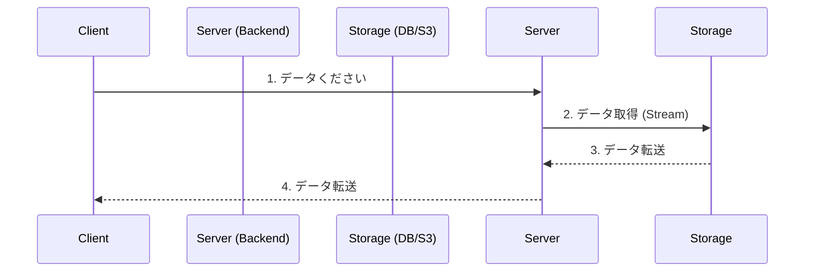
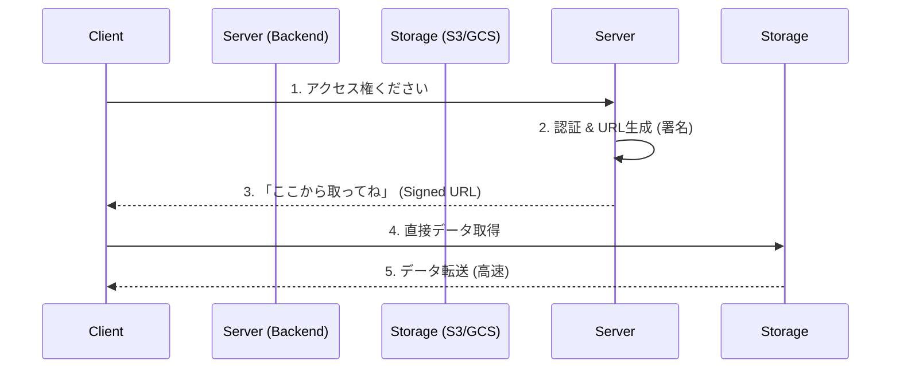

# バックエンドアーキテクチャのベストプラクティス：プロキシ vs 直接アクセス

2026-01-22

## 1. 疑問の背景

ユーザーからの質問：

> 「BackEndが全てのAPIを司っている（その裏のDBや処理エージェントにアクセスするときも、バックエンドを介す）のではないの？」

これは非常に一般的な、そして正しい直感です。通常、Webアプリケーションでは「3層アーキテクチャ」が採用され、クライアントはバックエンド（APIサーバー）とだけ話し、データベースや内部システムへのアクセスは全てバックエンドが仲介（プロキシ）します。これによりセキュリティと一貫性が保たれます。

しかし、**「大きなファイル（画像、動画、3Dモデル）」** の扱いについては、例外的なベストプラクティスが存在します。

## 2. 2つのパターン比較

### パターンA：バックエンド経由 (Proxy Pattern)

ユーザーの直感通りの構成です。全てのデータはサーバーを経由します。

- **メリット:**
  - 構成が単純。Docker内部名 (`minio`) のような問題が起きない（サーバーが解決できるから）。
  - 閲覧ログやアクセス制御を完全にサーバーでコントロールできる。
- **デメリット (致命的):**
  - **サーバー負荷:** 100MBのファイルを100人がダウンロードすると、サーバーのメモリとCPU、帯域を大量に消費します。
  - **スケーラビリティ:** ユーザーが増えると、アプリのロジック（計算）ではなく、ただのファイル転送のためにサーバー台数を増やす必要が出てきます（コスト増）。

### パターンB：署名付きURL / 直接アクセス (Direct Access Pattern) - **今回の採用手法**

クラウド時代のベストプラクティスです。「アクセス権（署名付きURL）」だけをサーバーが発行し、重たいデータの転送はストレージに任せます。

- **メリット:**
  - **高パフォーマンス:** AWS S3やGCSはファイル配信に特化しており、無限に近い帯域を持っています。
  - **サーバー負荷軽減:** バックエンドは「短いテキスト（URL）」を返すだけなので、何万人来てもビクともしません。
- **デメリット:**
  - **クライアントからのアクセス:** クライアント（ブラウザ）から直接ストレージが見える必要があります。
  - **今回のトラブル:** ローカル開発（Docker）では「ブラウザから見たストレージのアドレス (`localhost`)」と「サーバーから見たアドレス (`minio`)」が違うため、URLの書き換えというひと手間が必要でした。

## 3. 結論：なぜ今回はパターンBなのか？

3Dビューアーという特性上、扱うファイルサイズが大きくなる傾向があります（数MB〜数百MB）。
これを全てNestJSサーバー経由で配信すると、将来的にユーザーが増えた際、サーバーがボトルネックになってサービスが重くなるリスクが高いです。

そのため、**「ロジックはバックエンド、重いデータはストレージ直接」** という役割分担をするのが、スケーラビリティにおけるベストプラクティスとなります。
GCP (GCS) や AWS (S3) に移行した際、この設計であればサーバー構成を変えることなく、ストレージのパワーを最大限に活かすことができます。
