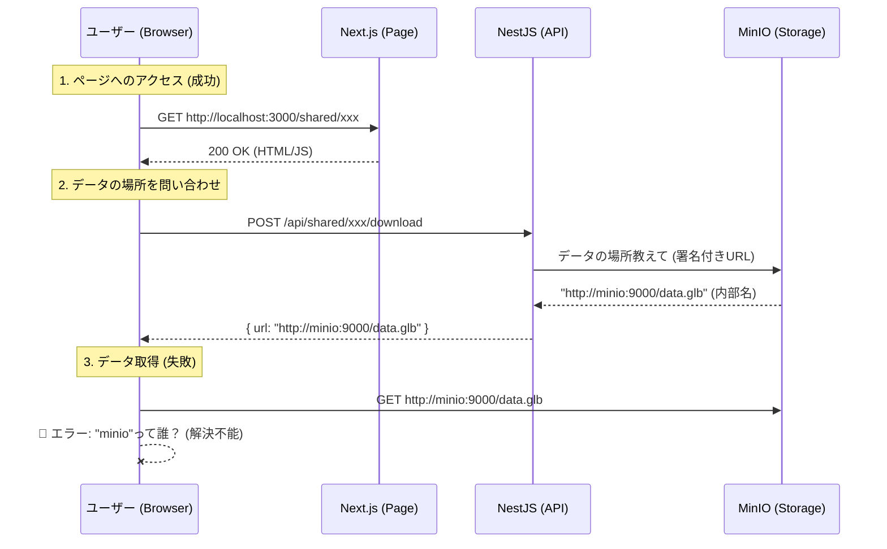
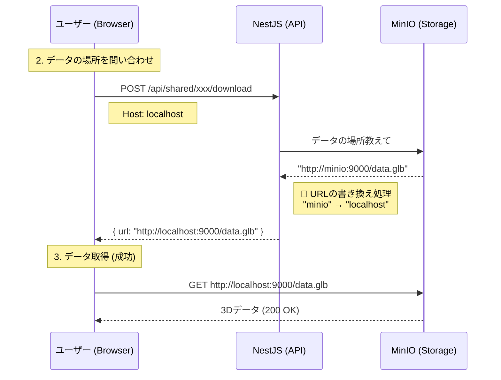

# 共有リンクアクセス障害と解決策 (2026-01-22)

## 1. ユーザーからの疑問

> 「ユーザーアクセスしているのは `http://localhost:3000/shared/...` だけど、どういうこと？」

この疑問はもっともです。なぜ `localhost:3000` にアクセスできているのに、裏で `minio` という名前が出てくるのか、その仕組みを解説します。

### 仕組みの解説

Webアプリケーションは主に2つの要素で動いています。

1.  **ページ本体 (HTML/JS):** `http://localhost:3000/...`
    - これはNext.jsサーバーから配信されます。ユーザーはここにアクセスして画面を見ます。これは成功していました。
2.  **3Dデータ (GLBファイル):** `http://minio:9000/...` (修正前)
    - 画面が表示された**後**、ビューアー（JavaScript）が3Dデータを読み込もうとします。
    - このデータのありか（URL）は、バックエンドAPIから教えてもらいます。
    - バックエンドはDocker内部にいるため、自分から見たストレージの場所である `http://minio:9000/...` をそのままフロントエンドに教えてしまいました。

ユーザーのブラウザは `localhost` (自分のPC) は知っていますが、`minio` (Docker内部のコンテナ名) という名前を知らないため、ページは開けても3Dデータだけが読み込めない（404/Name Not Resolved）という状態になっていました。

## 2. 障害の状況 (Before)

## 3. 解決策 And 解決後のフロー (After)

バックエンドサーバーが、クライアント（ブラウザ）がアクセスしてきているホスト名（`localhost`）を認識し、データのURLをそれに合わせて書き換えるようにしました。

## 4. GCP (Google Cloud Storage) 移行時の影響

この修正は「Docker環境特有の内部ホスト名問題」を解決するためのものです。
本番環境でGCP (GCS) を使用する場合、データのURLは `https://storage.googleapis.com/...` のように、インターネット上で誰でも解決できるドメインになります。
その場合、今回の書き換えロジックは単純に無視されるか、適用されないため、将来的な移行においても問題にはなりません。
